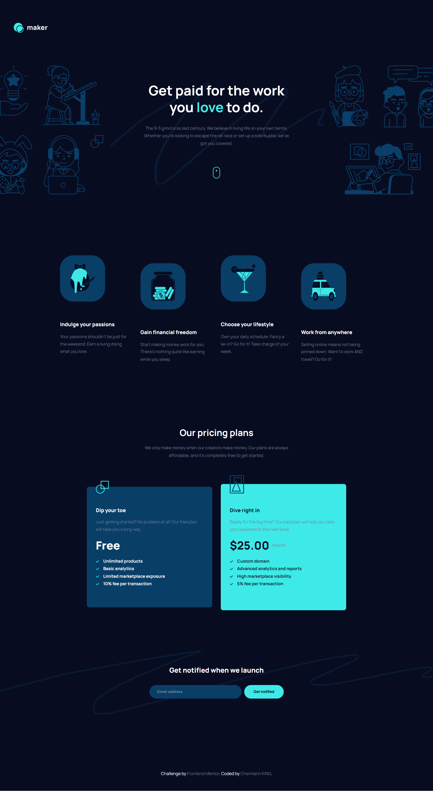

# Frontend Mentor - Maker pre-launch landing page

This is the [Maker pre-launch landing page](https://www.frontendmentor.io/challenges/maker-prelaunch-landing-page-WVZIJtKLd). Frontend Mentor challenges help improve coding skills by completing realistic projects.

## Welcome! 👋

Thanks for taking a look at my solution to this front-end coding challenge.

## Table of contents

- [Overview](#overview)
  - [Screenshot](#screenshot)
  - [Links](#links)
  - [Built with](#built-with)
- [Author](#author)

### Screenshot

### Links

- Solution URL: https://github.com/Chermann-KING/maker_pre_launch_landing_page---JUNIOR
- Live Site URL: URL_LIVE

### Built with

- Semantic HTML5 markup
- CSS custom properties
- Mobile-first workflow

## Author

- Website - [Hermann MOUSSAVOU](https://hermann-moussavou.com)
- Frontend Mentor - [Chermann KING](https://www.frontendmentor.io/profile/Chermann-KING)
- LinkedIn - [Hermann MOUSSAVOU](https://www.linkedin.com/in/hermann-moussavou)
